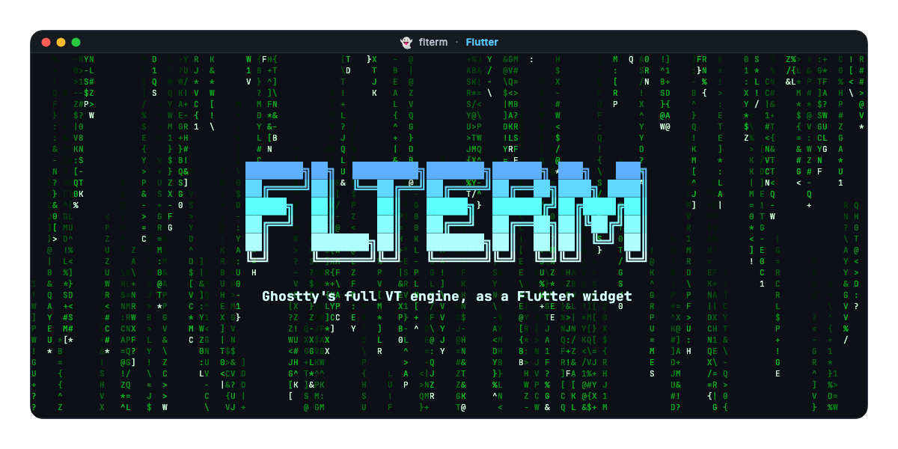

<p align="center">
  
</p>

<p align="center">
  <a href="https://pub.dev/packages/flterm"></a>
  <a href="https://github.com/elias8/libghostty/actions"></a>
</p>

Flutter terminal widget on top of [Ghostty](https://ghostty.org)'s
libghostty-vt engine.

| Android | iOS | Linux | macOS | Web | Windows |
|:-------:|:---:|:-----:|:-----:|:---:|:-------:|
|    ✅    |  ✅  |   ✅   |   ✅   |  ✅  |    ✅    |

## Overview

- Adapts to the host: mouse and keyboard on desktop, touch and soft
  keyboard on mobile, both on web.
- `TerminalController` owns the terminal and connects to a backend
  (PTY, SSH, socket) via output/resize/bell/title callbacks. Helpers
  for I/O, selection, focus, scrolling, paste, and mode toggling.
- Drag, double-click, triple-click, and Alt+drag selection over wide
  characters (CJK, emoji, VS16, combining marks) with cell-snapped
  boundaries.
- Built-in copy, paste, select all, and clear shortcuts with
  platform-aware defaults. Extend or replace with any Flutter
  `Intent`.
- Themes for ANSI 16, 256-color, and truecolor palettes; cursor;
  hyperlinks; fonts. Immutable and `lerp`-able.
- OSC 8 hyperlinks with idle and highlighted styles.

## Getting started

```yaml
dependencies:
  flterm: ^0.0.1
```

On web, initialize the wasm module once before mounting any terminal:

```dart
import 'package:flterm/flterm.dart';
import 'package:flutter/foundation.dart';

if (kIsWeb) {
  await initializeForWeb(Uri.parse('assets/libghostty.wasm'));
}
```

## Usage

A `TerminalController` owns the terminal and talks to your I/O. A
`TerminalView` renders it.

```dart
import 'package:flterm/flterm.dart';

final controller = TerminalController()
  ..onOutput = (bytes) => pty.write(bytes)
  ..onResize = (size) => pty.resize(size.cols, size.rows)
  ..onBell = playSound;

ptyOutputStream.listen(controller.write);

TerminalView(
  controller: controller,
  theme: TerminalTheme.dark(),
);
```

The same controller drives the terminal programmatically:

```dart
// I/O
controller.sendText('ls -la\n');

// Selection
controller.selectAll();
print(controller.selectedText());

// Clipboard
controller.paste('hello');

// Reset
controller.clear();
```

Custom themes are constructed directly:

```dart
TerminalView(
  controller: controller,
  theme: TerminalTheme(
    foreground: const Color(0xFFC5C8C6),
    background: const Color(0xFF1D1F21),
    ansiColors: const [/* 16 ANSI colors */],
    fontFamily: 'JetBrains Mono',
    fontSize: 14,
    cursor: const CursorTheme(shape: CursorShape.bar),
  ),
);
```

## License

MIT. See [LICENSE](LICENSE).
